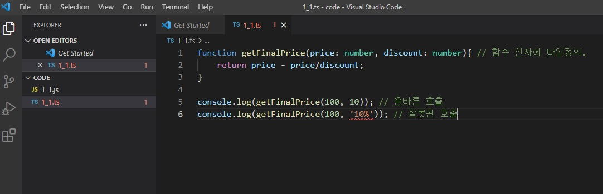

# 🐳 1.3 타입스크립트 컴파일러

타입스크립트 컴파일러는 IDE에 이미 내장되있거나 별도 IDE플러그인을 설치해 사용할 수 있다.

책에서는 Node.js 런타임을 사용. ( Node와 NPM을 설치 후 버전확인하기. )

타입스크립트 전역 설치

```shell
npm install -g typescript
tsc -v
```


## 🌏 컴파일 과정을 알아보자.

```typescript
// 1_1.ts
function getFinalPrice(price: number, discount: number){ // 함수 인자에 타입정의.
    return price - price/discount;
}

console.log(getFinalPrice(100, 10)); // 올바른 호출
console.log(getFinalPrice(100, '10%')); // 잘못된 호출
```

```shell
tsc 1_1
```

컴파일오류는 뜨지만 js파일은 생성이 된다.



 ### 👉 왜?

자바스크립트관점에서는 1_1.js는 유효하다. 그러나 실제 타입스크립트 프로젝트에서는 오류가 있는 파일을 생성할 수 없다.

타입스크립트 컴파일러에는 20개가 넘는 옵션이 있는데 그중 noEmitOnError를 알아보자.

### 👉 noEmitOnError

생성된 js파일을 삭제하고 noEmitOnError를 추가해 명령어를 실행.

```shell
tsc 1_1 --noEmitOnError true
```

오류를 고치지 않는이상 js파일이 생성되지 않는 걸 볼 수 있다.

❗ noEmitOnError사용시 타입스크립트 컴파일러는 모든 오류가 고쳐질 때까지 이전에 생성된 js파일을 덮어쓰지 않습니다.


### 👉 --t

특정 자바스크립트 버전을 가리킴.<br/>ES5, ES6이상의 문법으로 변환하고 싶을 때 사용 가능.

 ```shell
 tsc --t ES5 1_1
 ```

생성된 JS파일

```javascript
function getFinalPrice(price, discount) {
    return price - price / discount;
}
console.log(getFinalPrice(100, 10)); // 올바른 호출
// console.log(getFinalPrice(100, '10%')); // 잘못된 호출
```


### 👉 tsconfig.json

타입스크립트 컴파일러는 해당 소스, 최종 디렉터리, 타겟 등 옵션을 미리 설정할 수 있습니다.

프로젝트 폴더에 tsconfig.json파일이 있는 상태에서 tsc명령어 입력하면 tsconfig.json내의 모든 옵션을 읽습니다.

```javascript
{
    "compilerOptions":{
        "baseUrl":"src", // src폴더 내 모든 .ts파일을 컴파일
		"outDir":"./dist", // dist 폴더에 생성된 .js파일을 저장
        "noEmitOnError":true, // 컴파일 오류 발생 시, js파일 생성 X
        "target":"es5" // es5로 컴파일
    };
}
```

❗ 컴파일러의 옵션 대상은 구문 검사에도 사용된다


## 🌏 실습

```json
{
    "compilerOptions":{
        "noEmitOnError":true, // 컴파일 오류 발생 시, js파일 생성 X
        "target":"es5", // es5로 컴파일
        "watch":true // 컴파일러가 타입스크립트 파일이 변경될 때마다 다시 컴파일함.
    }
}
```

위 파일을 1_1과 같은 경로에 두고, 아래 터미널 명령을 실행

```shell
tsc
```


watch모드로 인해 컴파일러는 종료되지 않음을 볼 수 있다.

main.js파일은 생성되지 않습니다.

오류를 수정하면 main.js도 수정됨. (개싱기)

❗ 타입스크립트 프로젝트를 **처음 시작할 때 해당 폴더에서 tsc --init 명령어로 프로젝트를 초기화**함.<br/>생성된 **tsconfig.json에 모든 컴파일러 옵션이 있으며 대부분 코드가 주석처리 되있음. 필요에 따라 주석 처리를 제거.**


## 📘 참고

bit.ly/384AgfN