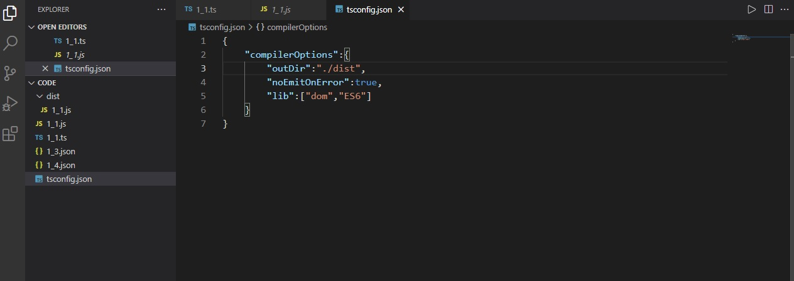

# 🐳 1.4 Visual Studio Code

## 🌏 vscode 설치

code.visualstudio.com/docs 의 setup메뉴를 참고해 사용하는 OS에 맞게 설치.

터미널에서 vs코드가 실행이 안되면 PATH를 추가.

```json
{
    "compilerOptions":{
        "outDir":"./dist", // dist폴더에 생성된 js파일을 저장
        "noEmitOnError":true, // 모든 오류가 고쳐진 후에 js파일을 생성
        "lib":["dom","ES6"] // 해당 라이브러리를 추가해야 tsc가 console.log()같은 웹 API를 인식함.
    }
}
```

tsconfig.json을 위와같이 수정 후 **tsc로 실행**.



위 사진과같이 dist에 1_1.js가 생긴걸 볼 수 있다.

! vs코드는 node.js 내 tsc컴파일러를 선택합니다.<br/>vs코드 맨 아래 툴바에서 tsc버전을 확인할 수 있습니다.

## 🌏 Extension 설치

### 👉 ESLint

자바스크립트 린터를 통합시켜 코드의 가독성과 보전성을 확인합니다.

### 👉 Prettier

코드 파싱 후 자체 규칙에 따라 자동으로 고쳐주어 일관적인 스타일을 적용함.

### 👉 Path Intellisense

자동으로 파일 경로를 고쳐줍니다.


❗ vs코드의 온라인 버전인 StackBlitz도 있다.

## 📘 참고

code.visualstudio.com/docs/languages/typescript

stackblitz.com